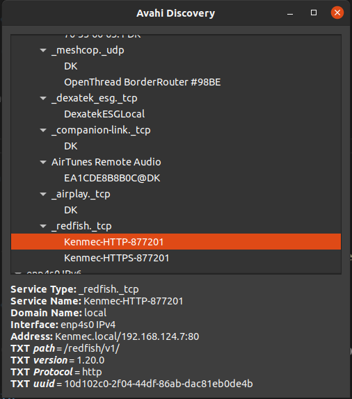

# Redfish API: OEM Kenmec IOBoards Read/Write API

## Board information

| USB slot | Board type |
|---------|-------------|
| 0 | AIO board |
| 1 | RTD/PWM board |

## Get Hub's IP Address (via mDNS tool or Avahi Discovery tool)

!!! warning "mDNS tool"
    Must be in the same network with the Hub.



---

# API List

## Get all IOBoards information

### Endpoint

```bash
/redfish/v1/ThermalEquipment/CDUs/1/Oem/Kenmec/IOBoards
```

### Request example

```curl
curl --location '192.168.124.184:8080/redfish/v1/ThermalEquipment/CDUs/1/Oem/Kenmec/IOBoards'
```

### Response example

```json
{
    "@odata.type": "#KenmecIOBoardCollection.IOBoardCollection",
    "@odata.id": "/redfish/v1/ThermalEquipment/CDUs/1/Oem/Kenmec/IOBoards",
    "Name": "Kenmec IOBoards Collection",
    "Description": "Collection of IO Boards for CDU 1",
    "Members@odata.count": 3,
    "Members": [
        {
            "@odata.id": "/redfish/v1/ThermalEquipment/CDUs/1/Oem/Kenmec/IOBoards/1"
        },
        {
            "@odata.id": "/redfish/v1/ThermalEquipment/CDUs/1/Oem/Kenmec/IOBoards/2"
        },
        {
            "@odata.id": "/redfish/v1/ThermalEquipment/CDUs/1/Oem/Kenmec/IOBoards/3"
        }
    ]
}
```

## Get particular IOBoards information (Board 1)

### Endpoint

```bash
/redfish/v1/ThermalEquipment/CDUs/1/Oem/Kenmec/IOBoards/1
```

### Request example

```curl
curl --location '192.168.124.184:8080/redfish/v1/ThermalEquipment/CDUs/1/Oem/Kenmec/IOBoards/1'
```

### Response example

```json
{
    "@odata.type": "#KenmecIOBoard.v1_0_0.IOBoard",
    "@odata.id": "/redfish/v1/ThermalEquipment/CDUs/1/Oem/Kenmec/IOBoards/1",
    "Id": "1",
    "Name": "IO Board 1",
    "Status": {
        "State": "Enabled",
        "Health": "OK"
    },
    "Actions": {
        "Oem": {
            "#KenmecIOBoard.Read": {
                "target": "/redfish/v1/ThermalEquipment/CDUs/1/Oem/Kenmec/IOBoards/1/Actions/Oem/KenmecIOBoard.Read",
                "title": "Read HID Board"
            },
            "#KenmecIOBoard.Write": {
                "target": "/redfish/v1/ThermalEquipment/CDUs/1/Oem/Kenmec/IOBoards/1/Actions/Oem/KenmecIOBoard.Write",
                "title": "Write HID Board"
            }
        }
    },
    "Oem": {
        "Kenmec": {
            "Pid": 162
        }
    }
}
```

!!! info "Pid"
    Pid 162 (0xA2) is AIO board.
    Pid 163 (0xA3) is represent RTD/PWM board.


## Read the IOBoards data (Board 1)

### Endpoint

```bash
/redfish/v1/ThermalEquipment/CDUs/1/Oem/Kenmec/IOBoards/1/Actions/Oem/KenmecIOBoard.Read
```

### Request example

```curl
curl --location '192.168.124.184:8080/redfish/v1/ThermalEquipment/CDUs/1/Oem/Kenmec/IOBoards/1/Actions/Oem/KenmecIOBoard.Read'
```

### Response example

```json
{
    "@odata.type": "#KenmecIOBoard.v1_0_0.ReadResponse",
    "@odata.id": "/redfish/v1/ThermalEquipment/CDUs/1/Oem/Kenmec/IOBoards/1/Actions/Oem/KenmecIOBoard.Read",
    "Port": 1,
    "PID": 162,
    "DO_0": 0,
    "DO_1": 0,
    "DO_2": 0,
    "DO_3": 0,
    "DO_4": 0,
    "DO_5": 0,
    "DO_6": 0,
    "DO_7": 0,
    "DI_0": 1,
    "DI_1": 1,
    "DI_2": 1,
    "DI_3": 1,
    "DI_4": 1,
    "DI_5": 1,
    "DI_6": 1,
    "DI_7": 1,
    "AIO_0_mode": 0,
    "AIO_1_mode": 0,
    "AIO_2_mode": 0,
    "AIO_3_mode": 0,
    "AIO_0_voltage": -181,
    "AIO_1_voltage": -12000,
    "AIO_2_voltage": -12000,
    "AIO_3_voltage": -12000,
    "AIO_0_current": 0,
    "AIO_1_current": 0,
    "AIO_2_current": 0,
    "AIO_3_current": 0
}
```

## Read the IOBoards data (Board 2)

### Endpoint

```bash
/redfish/v1/ThermalEquipment/CDUs/1/Oem/Kenmec/IOBoards/2/Actions/Oem/KenmecIOBoard.Read
```

### Request example

```curl
curl --location '192.168.124.184:8080/redfish/v1/ThermalEquipment/CDUs/1/Oem/Kenmec/IOBoards/2/Actions/Oem/KenmecIOBoard.Read'
```

### Response example

```json
{
    "@odata.type": "#KenmecIOBoard.ReadResponse",
    "@odata.id": "/redfish/v1/ThermalEquipment/CDUs/1/Oem/Kenmec/IOBoards/2/Actions/Oem/KenmecIOBoard.Read",
    "Port": 2,
    "PID": 163,
    "PWM_0_duty": 0,
    "PWM_1_duty": 0,
    "PWM_2_duty": 0,
    "PWM_3_duty": 0,
    "PWM_4_duty": 0,
    "PWM_5_duty": 0,
    "PWM_6_duty": 0,
    "PWM_7_duty": 0,
    "PWM_0_frequency": 0,
    "PWM_1_frequency": 0,
    "PWM_2_frequency": 0,
    "PWM_3_frequency": 0,
    "PWM_4_frequency": 0,
    "PWM_5_frequency": 0,
    "PWM_6_frequency": 0,
    "PWM_7_frequency": 0,
    "PWM_0_period": 0,
    "PWM_1_period": 0,
    "PWM_2_period": 0,
    "PWM_3_period": 0,
    "PWM_4_period": 0,
    "PWM_5_period": 0,
    "PWM_6_period": 0,
    "PWM_7_period": 0,
    "RTD_0_resistance": 11099,
    "RTD_1_resistance": 0,
    "RTD_2_resistance": 0,
    "RTD_3_resistance": 0,
    "RTD_4_resistance": 0,
    "RTD_5_resistance": 0,
    "RTD_6_resistance": 0,
    "RTD_7_resistance": 0
}
```

## Write the IOBoards data (Board 1)

### Endpoint

```bash
/redfish/v1/ThermalEquipment/CDUs/1/Oem/Kenmec/IOBoards/1/Actions/Oem/KenmecIOBoard.Write
```

### Request example (Control digital output 0)

```curl
curl --location '192.168.124.184:8080/redfish/v1/ThermalEquipment/CDUs/1/Oem/Kenmec/IOBoards/1/Actions/Oem/KenmecIOBoard.Write' \
--header 'Content-Type: application/json' \
--data '{
    "Pid": 162,
    "TimeoutMs": 2000,
    "DO_0": 1
}'
```

!!! info "Pid"
    The Pid need to be matched with the board type.

### Response example (Control digital output 0)

```json
{
    "@odata.type": "#KenmecIOBoard.v1_0_0.WriteResponse",
    "@odata.id": "/redfish/v1/ThermalEquipment/CDUs/1/Oem/Kenmec/IOBoards/2/Actions/Oem/KenmecIOBoard.Write",
    "Pid": 162,
    "Port": 2,
    "Status": "Success"
}
```

## Write the IOBoards data (Board 2)

### Endpoint

```bash
/redfish/v1/ThermalEquipment/CDUs/1/Oem/Kenmec/IOBoards/2/Actions/Oem/KenmecIOBoard.Write
```

### Request example (Control PWM_0_duty)

```curl
curl --location '192.168.124.184:8080/redfish/v1/ThermalEquipment/CDUs/1/Oem/Kenmec/IOBoards/2/Actions/Oem/KenmecIOBoard.Write' \
--header 'Content-Type: text/plain' \
--data '{
    "Pid": 163,
    "PWM_0_duty": 20
}'
```

### Response example (Control PWM_0_duty)

```json
{
    "@odata.type": "#KenmecIOBoard.WriteResponse",
    "@odata.id": "/redfish/v1/ThermalEquipment/CDUs/1/Oem/Kenmec/IOBoards/2/Actions/Oem/KenmecIOBoard.Write",
    "Pid": 163,
    "Port": 2,
    "Status": "Success"
}
```