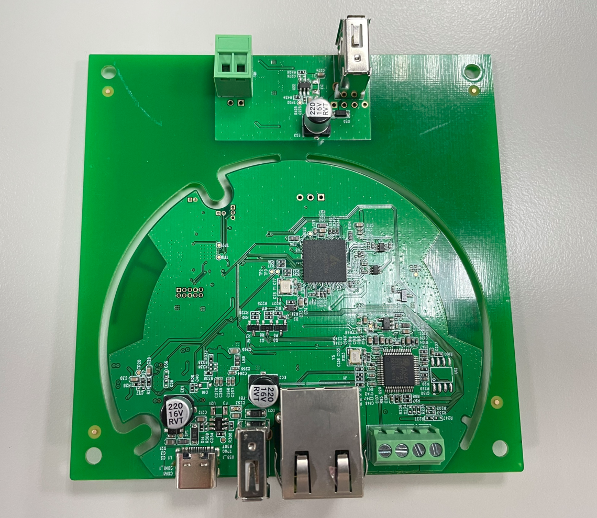
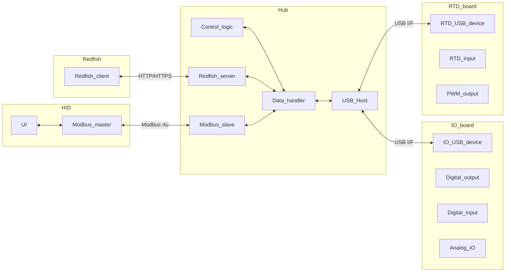

# Hub

---

## Specification

| Specific | description  |
| -------- | -----------  |
| Power | RATING: 5V 1A | 
| Interface | Ethernet   RS485   USB host |

---

## Key Features

- Redfish API server
- Modbus RTU slave
- Integrate up to 4 sub-boards (IO/RTD board)
- Build-in control logic

---

## Data Flow

---

## Get started

!!! abstract "Links"
    [Development environment](../getstarted/environment.md)  
    [Development tools](../getstarted/setup.md) 
    [How to build SDK](../getstarted/build_sdk.md) 
    [How to build application](../getstarted/build_kenmec.md) 
    [How to build OTA image](../getstarted/build_OTA_image.md) 
    [Get Hub's IP address](../getstarted/get_hub_ip.md) 

---

## Redfish APIs (WIP)

!!! abstract "Links"
    [/redfish/v1/ThermalEquipment/CDUs/1/Oem/Kenmec](../redfish/oem_kenmec.md) 
    [/redfish/v1/ThermalEquipment/CDUs/1/Oem/Kenmec/Config](../redfish/oem_kenmec_config.md) 
    [/redfish/v1/ThermalEquipment/CDUs/1/Oem/Kenmec/IOBoards](../redfish/oem_kenmec_ioboards.md) 
    [/redfish/v1/ThermalEquipment/CDUs/1/Oem/Kenmec/ControlLogics](../redfish/oem_kenmec_control_logic.md) 

---

## Tutorials

!!! abstract "Links"
    [Add new machine to control logic](../tutorials/add_new_machine_to_control_logic.md) 
    [API: Config machine type](../tutorials/Redfish_Config_machine_type.md) 
    [API: Config Modbus devices](../tutorials/Redfish_Config_modbus_devices.md) 
    [API: Config Temperature sensors](../tutorials/Redfish_Config_temperature_sensors.md) 
    [API: Config Analog input current sensors](../tutorials/Redfish_Config_analog_input_current.md) 
    [API: Config Analog input voltage sensors](../tutorials/Redfish_Config_analog_input_voltage.md) 
    [API: Config Analog output current sensors](../tutorials/Redfish_Config_analog_output_current.md) 
    [API: Config Analog output voltage sensors](../tutorials/Redfish_Config_analog_output_voltage.md) 
    [API: Control the I/O board](../tutorials/Redfish_Control_IOBoards.md) 
    [API: Control the control logic](../tutorials/Redfish_Control_control_logics.md) 

---

## Firmware Version History

!!! abstract "v1.0.1.16"

    Date: 2025-09-30

    **Changes**

    + xxx

    **Note**

    + xxx