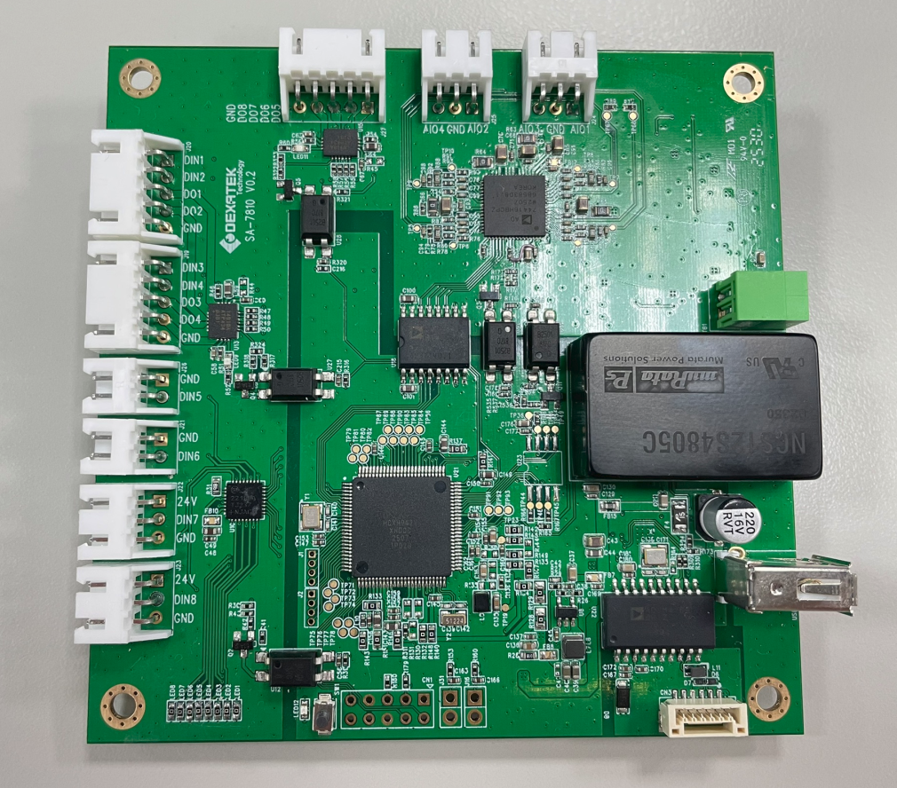

# I/O Board

- Digital I/O
- Analog I/O

## Specification

| I/O type | Channel number | Description |
| -------- | ----------- | ----------- |
| Digital Input | 8ch | 8ch digital input |
| Digital Output | 8ch | 8ch digital output |
| Analog Input/Output | 4ch | (Multiplexing pins)   voltage output: 0-10V   current output: 0-20mA   voltage input: 0-10V   current input: 0-20mA |

!!! info "Analog I/O mode"
    Analog I/O can be configured to voltage output, current output, voltage input, current input,  
    Please refer to the configuration file for the details.
